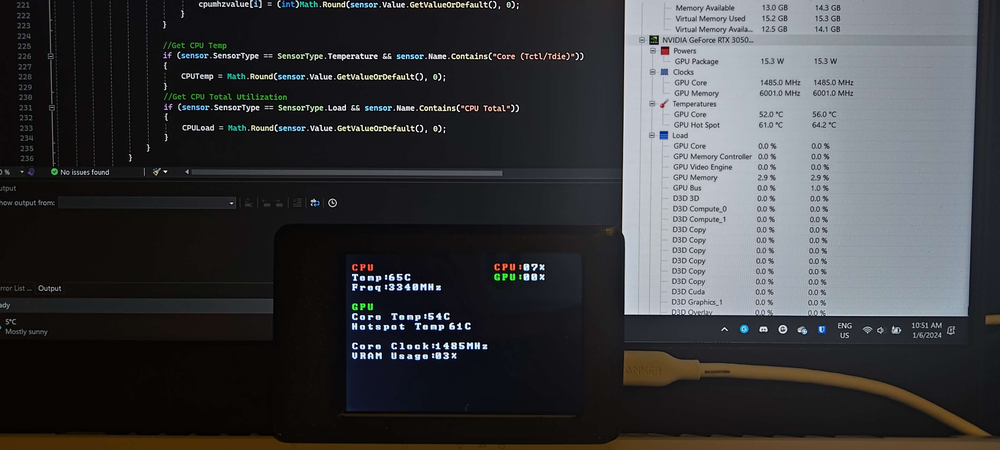

# Arduino Hardware Monitor

A pc hardware monitor based on the arduino mega 2560 and 3.5" tft display. 

The purpose of this project is to get rid my rtss overlay. I use rtss to make sure my compnents aren't overheating and to check if my undervolts are working. Unfortunately, the rtss overlay covers a lot of space on my screen and sometimes blocks crucial game information. 

Below is a guide on how to set up and customize the hardware monitor to personal use.

## Notes
This is a modified version of another github project found here: https://github.com/nemesisq3a/arduinoHwInfo

This project uses the LibreHardwareMonitor Library (from version 0.9.3) which can be found here: https://github.com/LibreHardwareMonitor/LibreHardwareMonitor

Currently, this only displays CPU (temp, freq, usage) and GPU (usage, core temp, memory junction temp, hotspot temp, coreclock, vram usage). An updated guide will later show how to modify the code to display your preferred info. 

Disclaimer: I am not a programmer so the code provided is probably not the most optimal. 

## Setup
- First download the [Arduino IDE](https://www.arduino.cc/en/software) and install the Adafruit GFX Library and MCUFriend_kbv libraries.
- Download and install visual studio. Check and install the .NET desktop development workload when installing VSCode.
- Download [LibreHardwareMonitor](https://github.com/LibreHardwareMonitor/LibreHardwareMonitor)
- Download the files in this repository and extract the folder to a suitable location

## Building
- Go to ArduinoIDECode/ArduinoHWMonitor and launch the ArduinoHWMonitor.ino file. It should then open up in your Arduino IDE.
- Upload the code to your arduino and take note of the com port.
- Go back to the main folder and open the ArduinoHwInfo.sln file. This should open visual studio.
- In the solutions explorer, right click on Form1.cs and click view code.
- On line 59, change the port baud rate to match your arduino's baud rate
- on line 209, change the gpu name in the quotes to match your gpu model. The exact name can be found when opening Libre Hardware Monitor (make sure the name is copied exactly as how Libre Hardware Monitor displays it).
- Save and build the solution. This will create ArduinoHwInfo.exe in ArduinoHwInfo/bin/Debug.
- Important: Run the executable as ADMIN. Otherwise wrong info may be displayed.
- If no device is deteced in COM3, double click on the arduino icon in the taskbar icons to open up the form application.
- Select the appropriate serial port and click start. Minimize the application to let it run in the background.
- Your arduino should be displaying your pc's respective hardware info.

Note: if you want this to run on startup, you will have to create a scheduled task in task scheduler. 

### Known Issues
Display is flickering - I've tried to counteract the flickering by trying to reduce the amount of needed screen updates. This was done in the by implementing a function that only updates the display value only if the new recieved value is different. I've also implemented a function to keep the length of the displayed string the same in order to the need to delete and fill new spaces. Unfortunately, the display still seems to flicker a lot during updates and I don't really know of a method to fix it. 

Zeroes in front of value - Related to above, this was a design choice by me so I can try to reduce flickering by not having to update new spaces on the display. This means that the value will never go above or below a certain set amount of digits. For example, if you set a max limit of 2 digits and the arduino recieves a value of 3, then it will display "03". Consequently, if the arduino recieves a value of 100 or above, it will display "99" instead. One can change the code to not constrain the digits if they wish but keep in mind that it may induce more display flickering. 

